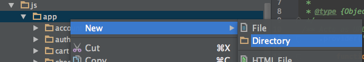
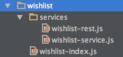

Create a new directory named **wishlist** in the **public/js/app** directory of your project. For example:



In the **wishlist** directory, add the **wishlist-index.js** file, which defines the wishlist module. Insert this code sample into the file:

``` javascript
/** Module related to wishlists. */

'use strict';

angular.module('ds.wishlist', [
    'ds.shared'
]);
```

The wishlist module has a dependency on the **ds.shared** module. An Angular service is needed to handle the REST requests and responses for your Wishlist service. Create a subdirectory of the **wishlist** directory named **services**. Add some new empty JavaScript files to the **wishlist/services** directory named **wishlist-service.js** and **wishlist-rest.js**. Your **wishlist** directory should look like the following example:



Add references to these files in the **public/index.html** file so the application can locate them. For example:

``` html
<script src="js/app/wishlist/wishlist-index.js"></script>
<script src="js/app/wishlist/services/wishlist-rest.js"></script>
<script src="js/app/wishlist/services/wishlist-service.js"></script>
```
