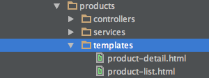
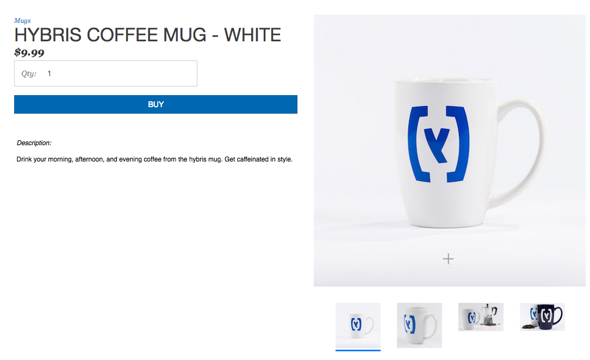
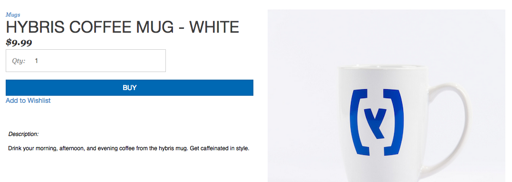
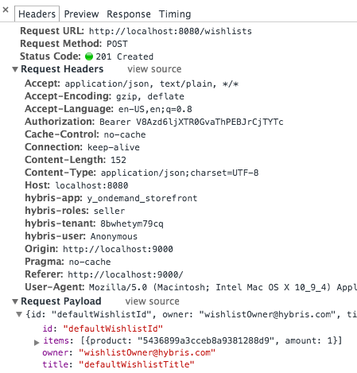

Find the product detail HTML file in the **templates** directory of the products module:



Look at the **Product Detail** page in your browser:



A good place for the **Add to Wishlist** button is directly under the **BUY** button and above the product's description, so find the code for the **BUY** button in the **product-detail.html** file. Search the file for the word **buy**, and you quickly find this block of code:

``` html
<div class="col-md-12 col-lg-12 buyButton">
    <button id="buy-button" ng-show="{{product.product.mixins.inventory.inStock}}" class="btn btn-primary " ng-click="addToCartFromDetailPage()" ng-disabled="!buyButtonEnabled">{{'ADD_TO_CART' | translate}}</button>
    <button id="out-of-stock-btn" ng-show="{{!product.product.mixins.inventory.inStock}}" class="btn btn-primary ">{{'OUT_OF_STOCK' | translate}}</button>
</div>
```

To have the **Add to Wishlist** button display under the **BUY** button, insert the following HTML code sample under the closing **&#60;/button&#62;** tag for the **Out of Stock** button:

``` html
<div class="col-md-12 col-lg-12">
    <a ng-click="addToWishlist()">Add to Wishlist</a>
</div>
```

The **class="col-md-12 col-lg-12"** CSS attribute is for alignment purposes. Because the text is wrapped in an **&#60;a&#62;** tag, it is automatically styled as a blue underlined link. Refresh the page, and you see the text under the **BUY** button:



Clicking the link calls the **addToWishlist()** function that you added to the scope of the **Product Detail** page controller. Open the network tab on your developer console, and click **Add to Wishlist**. The following request data is passed:



Unit tests for all controllers and services in the storefront template are written utilizing the <a href="http://jasmine.github.io/">Jasmine</a> testing framework for JavaScript. The tests are located in the **yaas-storefront/test** directory, and they are executed by running the Bash script **scripts/test.sh** from the root of the repository. Coverage reports are located in the **yaas-storefront/coverage** directory.
