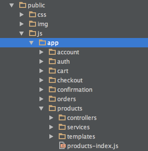
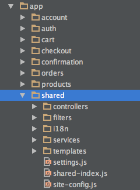

The directory structure of the template is organized by module, which means that all of the HTML code, controller code, and service code for anything related to products is all under the same **products** directory. Navigate into the **public/js/app/products** directory. All HTML and JavaScript code for both the **Product Details** page and the **Product** listing page exists here. The **products-index.js** file at the root of the **products** directory defines the product module and its dependencies. Following is an example of the directory structure:

Navigate to the **public/js/app/shared** directory. This special module contains various JavaScript components and HTML templates that are shared by more than one module in the application. This directory contains two important files: **settings.js** and **site-config.js**. The **settings.js** file stores crucial information, such as cookie names and REST header values. The **site-config.js** file configures the various service endpoints utilized by your storefront. Following is an example of the shared folder:

