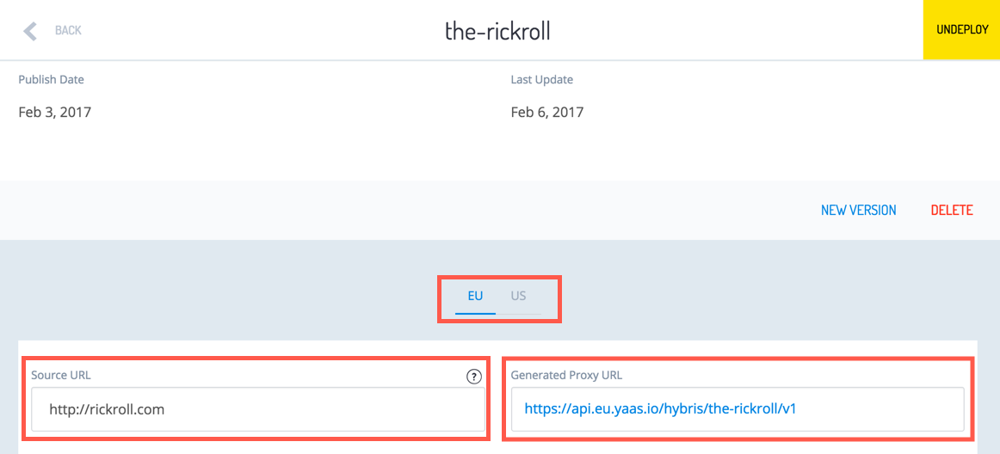
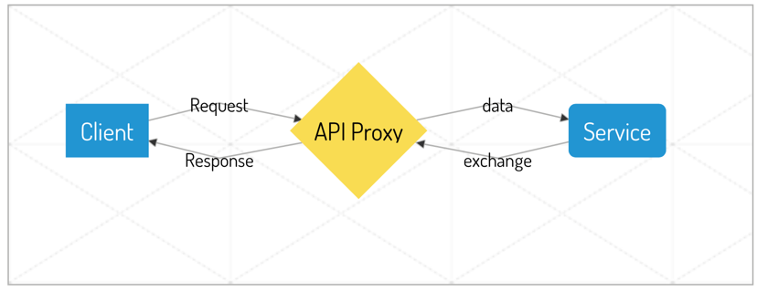

The **API Proxy** is an essential element of the YaaS architecture and serves the following purposes:
* Enforces security
* Enables central logging and tracing
* Ensures platform resiliency by implementing the rate-limiting and circuit-breaker mechanisms  

The API Proxy is a custom service that acts as an edge server and protects YaaS resources.
When you register a service in the Builder, a **Generated Proxy URL** is created. It masks the service's actual **Source URL**:

<p></p>

Different Generated Proxy URLs are created for the EU and US regions. You can switch between regions using the toggle on your Service's settings page.<br/><br/>

All communication between clients and services is routed through this unique proxy url:

```
graph LR     
A[Client]--Request--> B{API Proxy}
B--Data--> C(Service)
C--Exchange->- B
B--Response--> A
```
 <!--
<p></p>
-->

The API Proxy actively analyzes the YaaS traffic for the response codes, and triggers the relevant mechanism when suspicious activity is identified.

Based on the values of Hybris-specific headers, the API Proxy gathers information about tenants and services interactions. This is processed later for the billing purposes and package rate plans management.
