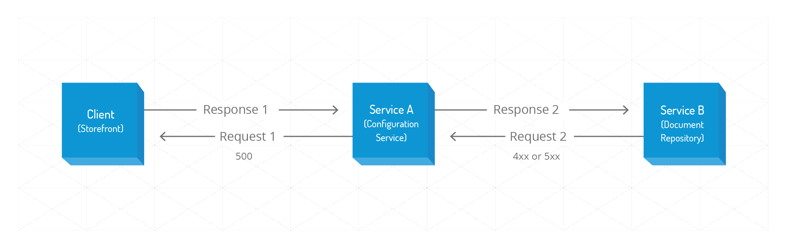

Every service in YaaS uses the common [error message schema](https://pattern.yaas.io/v1/schema-error-message.json) for error response payloads.

### Error type definition

An error response always contains these attributes:

- **status** – The original response code of the response.
- **type** – A Hybris-specific error type for classification of the error, as described in the table below.
- **message** – A message describing the problem in relation to the error type in human-readable form.
- **moreinfo** – A link to get more information on that kind of error type.

#### Example error message

``` json
{
    "status": 500,
    "type": "internal_server_error",
    "message": "Some unexpected internal error occurred, please contact support yaas.support@yaas.hybris.com",
    "moreInfo" : "https://pattern.yaas.io/errortypes.html"
}
```

An error can be due to multiple issues, or it can be specified in more detail using a more fine-grained error type. The error response contains an optional list of details, and the error detail consists of these attributes:

- **field** – A bean notation expression specifying the element in the request data causing the error, such as `product.variants[3].name`. This can be empty if the violation is not field-specific.
- **type** – A Hybris-specific error type for classification of the detailed error. The type must be a sub-type of the type specified in the common error payload.
- **message** – A message that describes the problem that is more specific to the sub-type.
- **moreInfo** – A link to information related to the sub-error type.


#### Example error response with details

``` json
{
    "status": "400",
    "type": "validation_violation",
    "message": "Several constraints violations while validating 'product'",
    "moreInfo" : "https://pattern.yaas.io/errortypes.html",
    "details":
    {
      [
        {
          "field": "Product.code",
          "type": "missing_field",
          "message": "A field expected but found null",
          "moreInfo" :"https://devportal.yaas.io/services/configuration/latest/index.html#Project-SpecificConfiguration"
        },
        {
          "field": "Product.sku",
          "type": "invalid_field_pattern",
          "message": "A field expected to match a pattern (nn-nn-nn) but found  (123456)"
        }
      ]
    }
}
```

### Service SDK Support
The **Service SDK** provides support for easily setting up [Jersey](https://jersey.java.net) applications using the error response format described above. For that, the Service SDK's [Jersey Support](/tools/servicesdk/index.html#jersey-support) library provides **Jersey ExceptionMapper** for the most common exceptions.
Furthermore, the Service SDK provides constants and error schema DTOs as part of the [Pattern Support](/tools/servicesdk/index.html#pattern-support) library.

### Glossary of error types
The table below includes a list of possible error types, their response codes, descriptions, and suitable messages. The **Error Description** column describes different error situations in more detail for developers who use the **message** attribute of an error response. The **Recommended Error Message** column contains suggestions for user-related error messages to display in front-ends. In general, response codes are divided into `4xx` for client-side errors, and `5xx` for server-side errors:

| HTTP Code | Top-Level Error Type | Sub-Level Error Type | Error Description | Recommended Error Message |
| - | - | - | - | - |
| **400** | **bad_payload_syntax** | | The request payload has incorrect syntax according to the sent **Content-Type**. Check the payload content for syntax errors, such as missing commas or quotation marks that are not closed. | Something went very wrong. Please try again. |
| **400** | **validation_violation** | **missing_field** | The requested body payload for a POST or PUT operation is missing, which violates the defined validation constraints. This denotes a missing field when a value is expected. | We need all required fields complete to keep you moving. |
| **400** |  | **invalid_field** | The requested body payload for the POST or PUT operation violates the validation constraints. This denotes specifically that there is:<ul><li>A type format incompatibility, such as specifying a pattern, but the given value does not match the pattern.</li><li>A type incompatibility, such as a field modeled to be an integer, but a non-numeric expression was found instead.</li><li>A range under or over flow validation violation cause.</li></ul> | We need all your entries to be correct to keep you moving. |
| **400** |  | **missing_header** | Any of the required headers is missing. Check the request to see if it contains the required header, or refer to the error details response to identify the missing header. | Something went very wrong. Please try again. |
| **400** |  | **invalid_header** | One or more sent headers has an invalid format. This denotes specifically that there is:<ul><li>A type format incompatibility, such as specifying a pattern, but the given value does not match the pattern.</li><li>A type incompatibility, such as a field modeled to be an integer, but a non-numeric expression was found instead.</li><li>A range under or over flow validation violation cause.</li><li>A value is longer than the maximum length. | Something went very wrong. Please try again. |
| **400** |  | **missing_query_parameter** | A required query parameter is missing. Check your request to ensure that it contains the required query parameters. | Something went very wrong. Please try again. |
| **400** |  | **invalid_query_parameter** | One or more sent query parameters has an invalid format. This denotes specifically that there is:<ul><li>A type format incompatibility, such as specifying a pattern, but the given value does not match the pattern.</li><li>A type incompatibility, such as a field modeled to be an integer, but a non-numeric expression was found instead.</li><li>A value is longer than the maximum length.</li></ul> | Something went very wrong. Please try again. |
| **400** |  | **invalid_uri_parameter** | One or more URI parameters have an invalid format in a request with creation semantic (usually POST on a specific resource). This denotes specifically that there is:<ul><li>A type format incompatibility, such as specifying a pattern, but the given value does not match the pattern.</li><li>A type incompatibility, such as a field modeled to be an integer, but a non-numeric expression was found instead.</li><li>A value is longer than the maximum length.</li></ul> For any non-creation semantic, like for a GET, a 404 response should be returned instead. | Something went very wrong. Please try again. |
| **400** |  | **out_of_range_parameter** | A query parameter has an invalid format. This could be due to a range under or over flow validation violation cause. Check your request to ensure it contains valid query parameters. | Something went very wrong. Please try again. |
| **400** | **business_error** | **imaginary_product_unavailable** | A business error indicating that a product with an imaginary description is not in the inventory. | Whoops! We can't find what you're looking for. Please try again. |
| **400** | **business_error** | **your_api's_specific_type** | Enter your description. | We need all required fields complete to keep you moving. |
| **401** | **insufficient_credentials** |  | No credentials are provided, or the provided credentials are refused. | Something went very wrong. Please try again. |
| **403** | **insufficient_permissions** |  | The credentials indicate a system-known user, but the user is not allowed to perform the requested operation. | Something went very wrong. Please try again. |
| **404** | **element_resource_non_existing** |  | The requested URI does not map to a resource. | Whoops! We can't find what you're looking for. Please try again. |
| **405** | **unsupported_method** |  | The requested resource does not support the specified HTTP action. Verify that you are calling an action supported by the requested endpoint. | Something went very wrong. Please try again. |
| **406** | **unsupported_response_content_type** |  | The client requested a response type which cannot be obtained from the requested resource. Check the requested endpoint response capabilities and compare them with your client **Accept** header. | Something went very wrong. Please try again. |
| **409** | **conflict_resource** |  | The requested resource could not be created, updated, or deleted due to server-side validation. This could be caused either by a temporary issue, such as an optimistic lock or persistent data constraint. Refer to the error details response to identify conflict details. | Something went wrong. Please try again. |
| **409** |  | **unique_index_violation** | The requested resource could not be created due to a uniqueness constraint. Assure that no resource exists having the same identifying attributes. | Something went wrong. Please try again. |
| **413** | **bad_payload_size** |  | The request payload is larger than the server can process. | Something went wrong. Please try again. |
| **414** | **uri_too_long** |  | The Request-URI is longer than allowed. This can occur when a client has improperly converted a POST request to a GET request with long query information or when the client has descended into a URI endless redirection, such as a redirected URI prefix that points to a suffix of itself. Also, it can occur when the server is under attack by a client attempting to exploit security holes present in some servers using fixed-length buffers for reading or manipulating the Request-URI. | Something went wrong. Please try again. |
| **415** | **unsupported_request_content_type** |  | The client sent a type of request which is not supported by the requested endpoint. Verify that your request's **Content-Type** matches the requested endpoint accepted content. | Something went wrong. Please try again. |
| **500** | **internal_service_error** |  | A server-side exception occurred that prevented the system from correctly returning the result. Refer to the error details response to identify exception details. | Something went very wrong. Please try again. |
| **500** | **backing_service_unavailable** |  | Some backing service is not available. Refer to the error details response to identify the origin of the problem. | Something went very wrong. Please try again. |
| **503** | **service_temporarily_unavailable** |  | A temporary service unavailability was detected. Refer to the error details response for a re-attempt strategy. | Something went very wrong. Please try again. |

### Constraint violation error handling

In general, there are two categories of constraints defined in the API definition. One category is specified in the JSON schema definition, which affects request and response payloads. The second category is specified by the RAML definition itself, which affects the related resource URL.

The following constraints of a JSON schema definition should all result in a `400 Bad Request` response with sub type `invalid_field`:

| JSON Type | Constraints |
| - | - |
| string | `maxLength`, `minLength`, `pattern`, `format: email` |
| integer | `minimum`, `exclusiveMinimum`, `maximum`, `exclusiveMaximum` |
| array | `minimum`, `minItems`, `maxItems` |
For more information about what these constraints mean, refer to the [JSON Schema Validation Specification](http://json-schema.org/latest/json-schema-validation.html)

The RAML specification enables you to provide a set of attributes, or named parameters, for properties modeled in the RAML content. An overview of constraint violations on which RAML element should return which kind of error is listed in this table:

| RAML Element | HTTP Code | Top-Level Error Type | Sub-Level Error Type |
| - | - | - | - |
| uriParameters | **404** | *element_resource_non_existing* | - |
| headers | **400** | *validation_violation* | *invalid_header* |
| queryParameters | **400** | *validation_violation* | *invalid_query_parameter* |

### Non-error scenarios
| Scenario | HTTP Code |
| - | - |
| successful GET | `200 OK` |
| successful POST | `201 Created` (+ Location header), `202 Accepted` |
| successful PUT | `204 No Content` |
| successful PATCH | `204 No Content` |
| successful DELETE | `204 No Content` |
| Authentication of OAuth get access token | `302 Found` |

### Authentication and authorization error responses
In order to access a service through a proxy in your request, you need to use an **Authorization** header with the **Bearer access_token_value** attribute. If the access token is invalid, you receive an error message with the proper information in the body.

#### No authorization header
This response happens when a **no authorization** header is given or the format is not correct. For example:

``` no-highlight
HTTP/1.1 401 Unauthorized
{
  "status" : 401,
  "message" : "Authorization: Unauthorized. Bearer TOKEN is missing",
  "type" : "insufficient_credentials",
  "moreInfo" : "https://pattern.yaas.io/errortypes.html"
}
```

#### Invalid access token
This response happens when the given access token is invalid. For example:

``` no-highlight
HTTP/1.1 401 Unauthorized
{
  "status" : 401,
  "message" : "Authorization: Unauthorized. Bearer TOKEN is invalid",
  "type" : "insufficient_credentials",
  "moreInfo" : "https://pattern.yaas.io/errortypes.html"
}
```

#### Lack of subscription
This response happens when the application does not have permission to access the proxy due to a lack of subscription to the product. For example:

``` no-highlight
HTTP/1.1 401 Unauthorized
{
  "status" : 401,
  "message" : "Application does not have permission to access the proxy due to lack of subscription to the product.",
  "type" : "insufficient_credentials",
  "moreInfo" : "https://pattern.yaas.io/errortypes.html"
}
```

#### Invalid scope
This response happens when the access token is valid, but you do not have permissions to that scope. For example:

``` no-highlight
HTTP/1.1 403 Forbidden
{
  "status" : 403,
  "message" : "Access denied - invalid scope",
  "type" : "insufficient_permissions",
  "moreInfo" : "https://pattern.yaas.io/errortypes.html"
}
```

#### Cannot find the service
This response happens when the service path does not exist. For example:

``` no-highlight
HTTP/1.1 404 NotFound
{
  "status" : 404,
  "message" : "Service does not exist",
  "type" : "element_resource_non_existing",
  "moreInfo" : "https://pattern.yaas.io/errortypes.html"
}
```

#### Unknown server error
This response happens when there are other internal server errors. For example:

``` no-highlight
HTTP/1.1 500 InternalServerError
{
  "status" : 500,
  "message" : "Invalid server settings. Please contact administrator.",
  "type" : "internal_service_error",
  "moreInfo" : "https://pattern.yaas.io/errortypes.html"
}
```

### Error response propagation
In the example below, an external client calls Service A and subsequently calls Service B to be able to fulfill the request.



If Service B answers the request with an error, the way in which Service A reacts when answering the client needs to be determined by noting the following:

- Service A has an API defined by the RAML definition. It is clearly defined what error responses are possible in each situation, and Service A conforms to that definition.
- The client calls Service A, not aware that it is dependent on nor calls Service B.
- The error responses defined in the API of Service A are different than the ones defined in the API of Service B.
- Service A always gets called by a valid tenant, application, and scopes combination as the request passes the proxy, which is not displayed.

Having these things defined, the following propagation rules are defined:

- Service A does not propagate the response of Service B to the client. A response code not listed in the API of Service A might contain messages with internal-only information.
- Always respond with a `500` static general error message, because the client cannot fix the problem. An example response is "Something went wrong." Use the `500` error in the following situations:
  + If Service B states that the passed tenant is invalid, then the proxy must be wrong and there is an internal bug or problem.
  + If Service B answers with a `408 Request timeout`, Service A retries the request. If the problem persists, use a fallback if available, otherwise, return a `500` error.
  + If Service B is not reachable, such as a `502 Bad Gateway` response, use a fallback if available, otherwise, return a `500` error.
  + If Service B is not reachable, such as a `503 Service Unavailable` response, use a fallback if available, otherwise, return a `500` error.
  + If Service B is not reachable, such as a `504 Gateway Timeout` response, use a fallback if available, otherwise, return a `500` error.
  + If a request to Service B times out like in a socket timeout, use a fallback if available, otherwise, return a `500` error.


